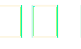

:title: Brève introduction à la cryptographie
:author: Saulo Pinto
:author: Christophe Monniez

:data-transition-duration: 1000
:skip-help: true
:auto-console: true

----

Brève introduction à la cryptographie
=====================================

Auteurs: 
    Saulo Pinto et Christophe Monniez

Sources:
    https://github.com/d-fence/crypto20min

----

:data-rotate: 30
:data-scale: 1.1

Plan
====

1. Introduction
2. Définitions
3. Historique
4. Leçons de l'histoire
5. Chiffrement informatique
6. Chiffrement symétrique - XOR
7. Concepts de chiffrement assymétrique
8. Fonctions de hachage cryptographiques
9. Failles célèbres dans les systèmes de chiffrement

----

:data-scale: 1.2

Introduction
============

* Chiffrement des communications
* Authentification des utilisateurs
* Monnaie électronique
* Vote électronique
* ...

----

:data-scale: 1

Définitions
===========

Cryptologie:
    Science du secret

Cryptographie:
    L'art des écritures cachées

Cryptanalyse:
    L'art de rendre clair un texte chiffré

Stéganographie:
    L'art de la dissimulation

.. note::
    * diminuer la confusion entre les termes utilisés. 
    * certains termes entendus proviennent directement de l'anglais, comme "encryption".

----

:data-scale: 1.2

Définitions
===========

Chiffrement:
    procédé par lequel on rend un message inintelligible pour ceux qui n'ont
    pas le code nécessaire pour le déchiffrement

Décryptage:
    procédé de déchiffrement sans connaître la clef de chiffrement.

Le chiffre :
    c'est la méthode de chiffrement ou l'organisme qui s'occupe de chiffrer

.. note::
    * préfréable d'utiliser le verbe "chiffrer" plutôt que "crypter" ou
      pire encore "encrypter".
    * Par contre décrypter peut convenir lorsque l'on déchiffre un message sans en possèder la clef.

----

:data-scale: 1.4

Définitions
===========

AES:
    Advanced Encryption Standard.

Rijndael:
    Algorithme de chiffrement symétrique choisis comme AES en 2000

RSA :
    Algorithme de chiffrement asymértique

.. note::
    * Rijndael: pour Rijmen et Daemen
    * RSA : pour Rivest - Shamir - Adleman
        * Utilisé avec GPG

----

:data-rotate: 60
:data-scale: 1

Historique
==========

* Hiéroglyphes transformés - 4000 ans
* Nabuchodonosor - Crane rasé des esclaves
* Spartiates: scytale

.. image:: 640px-Skytale.png

.. note::
    Une methode de cryptanalyse de la Scytale consisterait à essayer des
    cylindres de différents diamètres afin décrypter le message.

----

:data-scale: 1.1

Historique: Chiffre Atbash
==========================

* Utilisé par les hébreux
* Alphabet inverse:

.. image:: atbash-table.svg

.. note::
    Pour déchiffrer on recode le message chiffré

----

:data-scale: 1.2

Historique: Chiffre de César
============================

* 200 avant JC
* Simple substitution
* On décale l'alphabet d'un certain nombre de places

.. note::
    
    * Comme l'alphabet latin ne contient que 26 lettres, cette clef n'a                  
      donc que 25 positions possibles.                                                   
                                                                                   
    * Lorsque l'on utilise le code de César avec la clef 13, ce code peut aussi          
      porter le nom plus moderne de ROT13.                                               
                                                                                   
    * Le chiffrement par substitution simple peut être déjoué par l'analyse de fréquence.

----

:data-scale: 1.3

Historique: Analyse de fréquences
=================================

* Facilite le déchiffrement d'une simple substitution

.. image:: analyse.png
   :height: 400px

----

:data-scale: 1.4

Historique: Chiffre de Vigenère
===============================

* Évolution du code de César

.. image:: carre-vigenere.svg 
   :height: 400px

.. note::

    * Chiffrement poly-alphabetique
    * Résiste mieux à l'analyse des fréquences
    * Donner un exemple au tableau

----

:data-scale: 1.5

Historique: Cryptanalyse de Vigenère
====================================

* Chercher des motifs qui se répètent: cribs
* Permet de trouver la longueur de la clef
* Analyse des fréquences

----

:data-scale: 1.6

Historique: Radiogramme de la victoire
======================================

* "Munitionierung beschleunigen punkst soweit nicht eingesehen auch bei tag"
    * Déchiffré par Georges Painvin
    * Chiffre ADFGVX:
        * substitution
        * suivi d'une transposition

----

:data-scale: 1.7

Historique: Enigma
==================

.. image:: 509px-Enigma_machine4.jpg
   :height: 450px

.. note::
    
    * Carnet de note avec position rotors et cablages chaque jour
    * Code de trois lettres au début de chaque comm
    * Rotors tourne sur appui touche
    * Brute force par la "Bombe" 
    * Bletchey park

----

:data-scale: 1.8

Historique: Enigma
==================

* Capture d'un U-boot:
    * Mode d'emploi
    * Carnets de note

* Météo chifrrée:
    * mots devinables
    * cribs

* Doublement de la clef:
    * crib

----

:data-scale: 1

Leçons de l'histoire
====================

* La méthode devrait pouvoir tomber au mains de l'enemi
* Ne pas envoyer la clef de chiffrement avec le message
* Changer la clef de chiffrement
* Points faibles dans l'utilisation
* Echange d'un secret obligatoire = point faible

----

:data-scale: 1.2
:data-rotate: 90

Chiffrement informatique
========================

* Types de chiffrement:
    * Symétrique: clef identique chiffrement - déchiffrement
    * Asymétrique: clefs différentes

----

:data-scale: 1.4

Exemple de chiffrement symétrique avec XOR
==========================================

Table de vérité XOR:

.. image:: table-verite-xor.svg
   :width: 640px

----

:data-scale: 1.6

Exemple de chiffrement symétrique avec XOR
==========================================

.. image:: message-xor.svg
    :width: 700px

----

:data-scale: 1

Concepts de chiffrement asymétrique
===================================

* Chiffrement avec une fonction difficilement réversible
    * Le paramètre de cette fonction est la clef publique
* Porte dérobée pour déchiffrer (clef secrète)
* Pas utilisé pour chiffrer en temps réel car trop lent

----

:data-rotate-x: 180

----

----

----

----

----

----

----

:data-rotate-x: 0
:data-scale: 1.2

Chiffrement asymétrique: GPG/PGP
================================

* chiffrer des messages
* Générer une paire de clef
* Protéger la clef privée
* Réseau de confiance
* Empreinte de la clef publique
* Signer et authentifier
* Chiffrer pour plusieurs personnes
* Chiffrer pour soi-même 

.. note::
    * Parler des paquets signés (Debian ...)

----

:data-scale: 1.4

Chiffrement asymétrique
=======================

Exemples d'utilisation conjointement au chiffrement symétrique:

    * ssh
    * ssl et tls
    * open vpn

----

:data-rotate: 120    
:data-scale: 1

Fonctions de hachage cryptographiques
=====================================

    * Calculer une empreinte cryptographique.  
    * Certifier qu'un message n'a pas été modifié.
    * Risque de collisions existe.
    * Faille = possible de provoquer une collision 

----

:data-scale: 1.2

Fonctions de hachage cryptographiques
=====================================

    * md5
    * sha1
    * sha256
    * sha384
    * sha512
    * tiger
    * whirlpool
    * ...

----

:data-scale: 1.4

Fonctions de hachage cryptographiques
=====================================

Exercice:

.. code:: bash

    $ echo "Mon joli message" | md5sum
    a020b4d442d2c2997711a050daf2d155  -

.. note::
    * Changer un bit
    * e = 101 et f = 102

----

:data-rotate: 150
:data-scale: 1

Failles - Epic Fail
===================

* CVE-2008-0166: Générateur de nombres aléatoires

----

:data-scale: 1.1

Failles - Epic Fail
===================

* CVE-2014-1266 - "Apple goto fail" 

.. code:: c
        
        hashOut.data = hashes + SSL_MD5_DIGEST_LEN;
        hashOut.length = SSL_SHA1_DIGEST_LEN;
        if ((err = SSLFreeBuffer(&hashCtx)) != 0)
            goto fail;
        if ((err = ReadyHash(&SSLHashSHA1, &hashCtx)) != 0)
            goto fail;
        if ((err = SSLHashSHA1.update(&hashCtx, &clientRandom)) != 0)
            goto fail;
        if ((err = SSLHashSHA1.update(&hashCtx, &serverRandom)) != 0)
            goto fail;
        if ((err = SSLHashSHA1.update(&hashCtx, &signedParams)) != 0)
            goto fail;
            goto fail;
        if ((err = SSLHashSHA1.final(&hashCtx, &hashOut)) != 0)
            goto fail;
        err = sslRawVerify(...);

----

:data-scale: 1.2

Failles - Epic Fail
===================

* CVE-2014-0092 - "Gnu TLS goto fail"
* CVE-2014-0160 - "Heartbleed"

----

Informatique quantique
======================

----

:data-rotate-x: 90
:data-scale: 0.1

Outils utilisés pour la présentation
====================================

impress.js:
    https://github.com/bartaz/impress.js

hovercraft:
    https://github.com/regebro/hovercraft

Merci
=====

